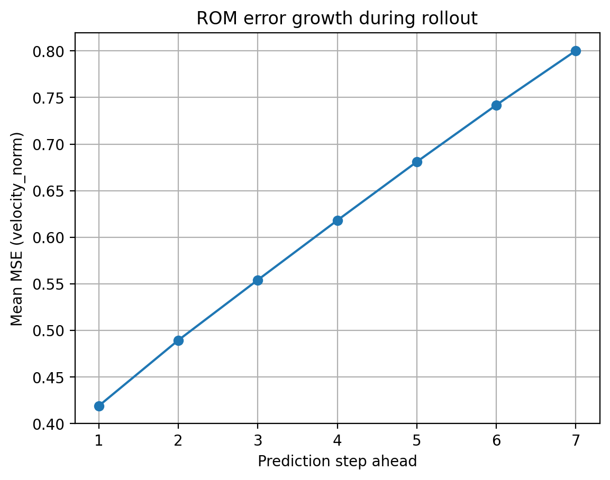
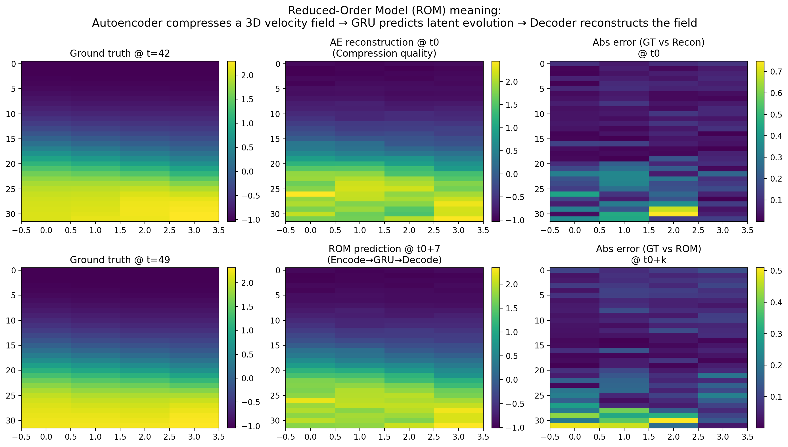

# Deep Learning Reduced-Order Modeling (ROM) for Turbulence Prediction

This project builds a **Reduced-Order Model (ROM)** that predicts short-horizon future turbulent velocity fields **much faster** than running a CFD solver.

**ROM meaning (end-to-end):**
**3D velocity field → Autoencoder (compress) → GRU (predict in latent space) → Decoder (reconstruct)**

---

## Dataset
- Dataset: `channel` (velocity field)
- Variable: velocity components **(u, v, w)**
- Each snapshot cutout shape: **(32, 32, 4, 3)** = (z, y, x, components)
- Total snapshots used: **50** (t=1 to t=50)

> Note: raw `.h5` files are not uploaded to GitHub due to size.

---

## Key Results (Numerical)
### Preprocessing
- Train/Val/Test split: **35 / 7 / 8**
- Train mean (u,v,w): **[0.22641191, 0.00260605, 0.00066294]**
- Train std  (u,v,w): **[0.21739997, 0.01447814, 0.03725065]**

### Compression (Autoencoder)
- Latent dimension: **128**
- Compression ratio: **12,288 → 128 ≈ 96×**
- Best AE validation loss: **0.093677**

### Latent Dynamics (GRU)
- Best GRU validation loss: **1.629464**
- Rollout evaluated: **7 steps forward**

### Accuracy vs Horizon
Error grows with prediction horizon (expected for turbulence):
- Step 1 MSE ≈ **0.42**
- Step 7 MSE ≈ **0.80**

### Computational Efficiency (Inference Speed)
- Average ROM rollout time for 7 steps (encode + GRU + decode): **0.018604 s** (CPU)
- ≈ **2.66 ms per predicted step**

---

## Visual Results
### ROM error growth with rollout horizon


### What ROM means (compression + prediction + errors)


---

## How to Run

### 1) Install dependencies
```bash
pip install -r requirements.txt
